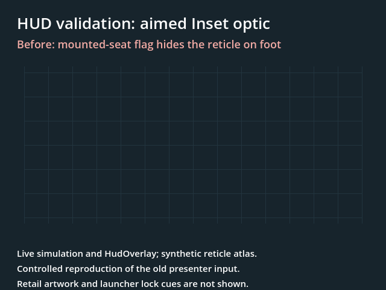
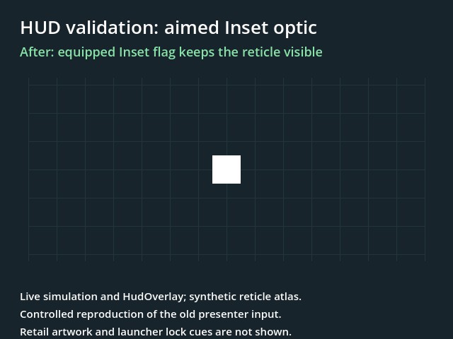

# Weapon and vehicle HUD validation — 2026-09-19

The seat-dependent HUD rules, mounted stance feed, Inset reticle selection,
and capacity-one ammo flash are corrected and covered by regressions. This
validation does **not** establish complete visual parity for Javelin, Stinger,
mortar, tank, or aircraft HUDs: several targeting and instrument elements are
still absent, and retail assets were unavailable for mission comparisons.

## Reference and scope

Compared the live IDA MCP database `Jointops.exe.kong.i64` (image base
`0x400000`) with `~/Development/jo-c/Jointops.exe.kong.c`, jo-c revision
`1dfaae1a2aaf9e7879cfae60d7aa8d1461867486`. The OpenNova starting point was
`1d092a0dc` on PR #655. The evidence is the original function bodies, not their
sometimes misleading names. No reference files or IDB records were changed.

| Routine | What it establishes |
| --- | --- |
| `HUD_RenderOverlays @0x5A7BB0`, seat dispatch `@0x5A7CC0..0x5A7D55` | Separate gunner, passenger, pilot/controller, driver, and on-foot draw branches |
| `HUD_BuildEntityInfo @0x4B8440` | Displayed ammo, player stance, mounted root, and aircraft feed fields |
| Weapon parser `@0x544174..0x54419B` | `emplacedstance` writes weapon definition offset `+228` |
| `Player_IsVehicleHasAutoAim @0x4DCCB0` | Actually tests the equipped weapon's `flags2 & 0x200` (Inset), regardless of seat |
| `HUD_DrawCrosshair @0x592640` | Spread reticle, tracked-target cursor, custom aim-point quad, and target brackets |
| `HUD_DrawScopeOverlayDetails @0x59E420` | Promoted scope/sight gates, range, zero/elevation, magnification, and a separate emplaced reticle branch |
| `hud_draw_target_entity_overlay @0x59A5D0` | Vehicle status sprite and localized control/stance text |
| `HUD_DrawVehicleHealthBars @0x5A4FD0` | Hull silhouette and occupied/empty/own-seat markers |

## Mode matrix

WPNGRP below means the weapon-group declutter flag. XHAIRS independently gates
the crosshair complex. Whole-HUD level 3 suppresses all these gameplay groups.

| Player context | Original display behavior | Validation result |
| --- | --- | --- |
| On foot, including a lowered launcher | WPNGRP controls ammo/name, round icons, and stance. The health bar reads the player. | Fixed the stance gate; native regressions pass. |
| Raised Javelin/Stinger or another optic | Authored Scoped/Sighted/Inset/SIGHTS flags select the optical view. Rangefinder and Zeroable gate their text; magnification appears for Scoped. | Existing scope/readout tests pass. Corrected Inset reticle feed; real GameWorld/presenter raise/lower/switch test passes. Actual launcher art and target cues remain unverified or absent below. |
| Mortar | Applicable weapon/seat rules plus the flag-`0x200` scoped terrain-ring pass. Scope zero/elevation text follows Zeroable, not a newly invented tube-angle label. | Common HUD rules tested. The distinctive mortar terrain view is still absent (D-HUD-26). |
| Gunner, seat 3 | WPNGRP controls ammo/name/icons, stance, and hull/seat panel. Stance uses the authored one-based `emplacedstance`, otherwise emplacement/carrier defaults; organic mounted and parachute flags override it. | Parsed definition -> installed weapon -> native view regression passes. Panel re-root and health/seat tests pass. |
| Passenger, seat 1 | Stance and vehicle panel remain visible independently of WPNGRP. Ammo/name/icons follow WPNGRP. | Seat transition matrix passes. |
| Pilot/controller, seat 2; driver, seat 5 | Stance and panel remain visible. Ammo/name/icons appear only for weapon category >9, independently of WPNGRP. Vehicle control/status text is a separate draw. | Fixed ammo/group dispatch. Vehicle control/status text remains absent. |
| Aircraft pilot/driver | The above rules, plus aircraft-family-3 ground-relative altitude, absolute altitude, vertical velocity, and power inputs; ALTGRP gates the instrument draw. | Feed and draw entry points identified; the flight instrument display remains absent. |
| Dismount | Return to infantry stance and WPNGRP behavior; hide the vehicle panel. | Native view and draw-list transitions pass, including inactive weapon/no-player resets. |

The player health bar and vehicle panel use distinct values: rider health for
the player bar, hull health for the silhouette, occupant health for occupied
seat boxes. Existing `vehicle_panel_feed` and `hud_vehicle_panel` tests cover
the panel's data and color/marker behavior.

## Corrected divergences (D-HUD-28)

- The presenter supplied infantry animation stance and no HUD seat/category
  context. Native view facts now carry the original mounted stance rules, with
  `emplacedstance` parsed and retained through weapon installation. Infantry
  animation stance is unchanged.
- The compiler applied one generic weapon-group gate to every seat and drew
  stance even when the on-foot group was hidden. The original seat dispatch
  now controls weapon text, round icons, stance, and gunner panel visibility.
- The presenter used occupied vehicle context to keep the aimed reticle up.
  The original query reads **Inset on the equipped weapon**. That flag now
  drives this exception, including on foot.
- Capacity-one ammo was already folded by the HUD feed, but the compiler
  folded the chamber again for its flash key. A reload therefore restarted
  the flash while the displayed total stayed constant. The flash now consumes
  the same already-folded total as the text and icons.

The initial regression run failed with `on-foot stance hides with WPNGRP` and
`a single-shot reload does not restart the ammo-change flash`. Both pass after
these corrections.

## Remaining HUD work

| Gap | Original evidence and required behavior |
| --- | --- |
| Tracked-target cursor | `@0x592790..0x592875`: project the target's **weapon fire origin/userpoint**, with authored cursor art, team color/texture selection and blink. Missile guidance's raw Position is a different consumer. |
| Custom weapon aim-point quad | `flags2 & 0x80`, `@0x592973..0x592AC8`: mounted userpoint/raycast projection with the weapon's own crosshair record. |
| Target brackets | `@0x592CE2..0x592DD7`: four clipped lines, target **item-definition type 3**, team/blink/pool rules. The old RE note calling this target mount state 3 was incorrect. These are not a generic launcher lock-progress meter. |
| Emplaced scope reticle | Flag-8 branch of `HUD_DrawScopeOverlayDetails @0x59E420`: attached-gun aim and custom reticle/line projection. |
| Sighted hit-feedback exception | `dword_A8235C` writers `@0x42FF60/@0x42FF74` and crosshair gate `@0x592AFA`: the retained peer-hit countdown and promoted Sighted predicate are not yet modeled by this HUD feed. |
| Mortar terrain scope | D-HUD-26: `Render_RadarCompassOverlay @0x5C9740`, caller gate `@0x5CA949`; ring clipping, another terrain scene, and an additional offset/shaken camera sample. |
| Vehicle control/status and aircraft instruments | Status `@0x59A5D0`; aircraft feed `@0x4B86CF..0x4B8734`; altitude/power draw `@0x59F050`. A hull/seat panel does not replace these elements. |

## Verification

- Native build and **19 focused suites passed**: HUD math/compiler, sight
  overlay, vehicle panel/feed, plus the 14 gameplay/network suites from the
  [weapon parity pass](../world/special-weapons-parity.md).
- Godot GDExtension build passed. Headless HUD/presenter run: **34 passed,
  4 pending, 389 assertions**. GPU run: **35 passed, 3 pending**; the multiplyat
  transparency/pixel-readback check passes with a RenderingDevice.
- Three remaining Godot cases require the retail `hudpos.def`/weapon fixture
  set under `OPENNOVA_JO_ASSETS`. Exact shipped Javelin, Stinger, mortar, and
  vehicle artwork, layouts, and live mission transitions need that comparison.
- Regression commands:

```powershell
ctest --test-dir build -C Release --output-on-failure -R '^(hud_frame_compiler|hud_math|hud_vehicle_panel|vehicle_panel_feed|sight_overlay|local_player_view)$'
& ./.godot-bin/Godot_v4.6.1-stable_win64_console.exe --headless --path godot -s addons/gut/gut_cmdln.gd -gtest=res://tests/hud_overlay_test.gd,res://tests/hud_sights_card_test.gd,res://tests/hud_presenter_lanes_test.gd,res://tests/game_hud_presenter_declutter_test.gd -gexit
```

The same Godot command without `--headless` runs the pixel check. Test runs
used a separate `APPDATA` directory under `.scratch`.

### Controlled before/after capture

These GPU-rendered images use the real live simulation/presenter and
`HudOverlay`, with a synthetic 64x64 reticle atlas and WPNGRP hidden to isolate
the reticle. The before image reproduces the previous presenter input
(`vehicle_attack_context = false` on foot) on the same aimed Inset state;
the after image uses the corrected native Inset fact. They are a logic witness,
not a retail-art or full launcher-HUD comparison. The temporary capture
harness was removed from the regression test after rendering.

| Before (old input reproduced) | After |
| --- | --- |
|  |  |
